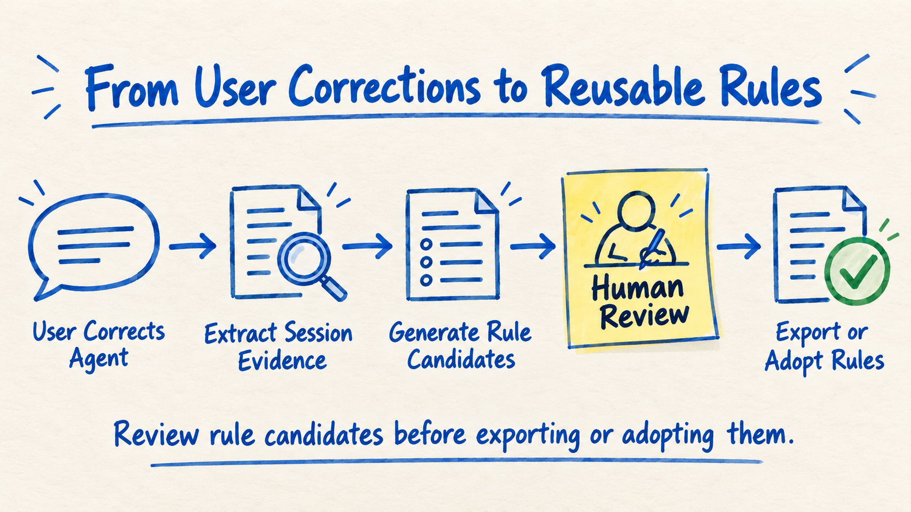

<div align="center">

<h1> session-correction-analysis</h1>

[](LICENSE)
[](https://nodejs.org/)
[](https://github.com/timestatic/session-correction-analysis/tags)
[](https://www.npmjs.com/package/session-correction-analysis)
[](https://www.npmjs.com/package/session-correction-analysis)
[](https://github.com/topics/agent-skills)
[](https://github.com/topics/agentic-coding)
[](https://github.com/topics/claude-code)
[](https://github.com/topics/codex)
[](https://github.com/topics/deepseek-harness)
[](https://github.com/topics/human-in-the-loop)

[English](README.md) · [简体中文](README-zh.md)



</div>

Turn the corrections you make to Agents during Claude Code / Codex / DeepSeek Harness (DSH) sessions into durable engineering rules that are **evidence-backed, human-approved, revisable, and revocable**.

`session-correction-analysis` (`sca` for short) is neither a general session summarizer nor a general-purpose memory plugin. It addresses a narrower but higher-impact category of information: **engineering conventions and procedural memory arising when users correct an Agent**.

A project's harness documentation system—the `AGENTS.md` / `CLAUDE.md` entry points, conventions such as invariants / architecture / infrastructure, linters, and project-level or user-level Agent memory—forms the behavioral foundation for AI coding assistants. But this system can decay over time: corrections in sessions do not flow back promptly, old rules go unreviewed for long periods, and documentation, constraints, and actual behavior gradually diverge. The goal of `sca` is to add an evidence-backed, reviewed, revocable rule supply chain to that system.

The model interprets semantics; the CLI freezes input, verifies evidence, and maintains authoritative state. Candidate rules are not automatically written into the harness documentation system or Agent memory, and are not automatically approved. After review, users decide whether to feed rules back into entry-point files, specialized conventions, lint constraints, or the appropriate memory system.

## Contents

- [Why it is needed](#why-it-is-needed)
- [When to use it—and when not to](#when-to-use-itand-when-not-to)
- [How it differs from session summaries and memory plugins](#how-it-differs-from-session-summaries-and-memory-plugins)
- [60-second quick start](#60-second-quick-start)
- [Example: from one correction to a durable rule](#example-from-one-correction-to-a-durable-rule)
- [How it works](#how-it-works)
- [Core guarantees](#core-guarantees)
- [Privacy and network boundaries](#privacy-and-network-boundaries)
- [Limitations](#limitations)
- [Manual CLI workflow](#manual-cli-workflow)
- [Data directory](#data-directory)
- [Common commands](#common-commands)
- [Automation and scheduled analysis](#automation-and-scheduled-analysis)
- [License](#license)

## Why it is needed

AI coding sessions often follow this pattern:

1. The Agent misunderstands a requirement, performs an inappropriate operation, or writes code that needs rework;
2. The user points out the problem during the session;
3. The Agent adjusts immediately;
4. Once the session ends, the correction remains scattered in the transcript;
5. A later Agent makes the same mistake again.

Asking the model directly to summarize the current session is suitable for a one-off retrospective. But when a rule will affect a project or team over the long term, more questions need answers:

- Which session, and which fixed portion of its input, was analyzed?
- Was every user message examined?
- Do the passages cited by a candidate actually appear in the transcript?
- Is a claim that something was “reworked” supported by actual edits and successful results?
- Which items are merely model suggestions, and which have been approved by a user?
- Does an old approval remain valid after a candidate is changed?
- How can an adopted rule later be revised or revoked?

`sca` organizes these questions into a governable engineering process:

```text
Session transcript
  → freeze input and generate an evidence packet
  → host Agent analyzes corrections, interventions, and rework
  → CLI validates the analysis result
  → user reviews rule candidates
  → feed rules back into the harness documentation system / Agent memory, or record them in the rules ledger
  → revise or revoke them later
```

## When to use it—and when not to

| Scenario | Recommendation |
|---|---|
| The current session is short and you only want an immediate retrospective | Asking the model directly is usually simpler |
| The result will not become a long-term convention, and the cost of an analytical error is low | You may not need `sca` |
| Analyzing a historical session | `sca` is suitable |
| A long session may have undergone context compaction or trimming | `sca` is suitable |
| Analyzing multiple sessions in batches or on a schedule | `sca` is suitable |
| Rules will enter the harness documentation system, lint constraints, or shared memory | `sca` is suitable |
| You need source evidence, human approval, versioning, and a revocation record | `sca` is suitable |
| You want automatic approval and direct modification of the harness documentation system | Not suitable; `sca` explicitly preserves the human review boundary |
| You want to store task progress, project facts, or a complete user profile | Not suitable; `sca` is not a general-purpose memory system |

## How it differs from session summaries and memory plugins

All three approaches may read sessions and extract information, but they solve different problems:

| Approach | Primary goal | Typical output | Governance focus |
|---|---|---|---|
| Ask a model directly to summarize a session | Describe what happened this time | Session summary, action items, temporary suggestions | Speed and low cost |
| Memory plugin | Make project facts, user preferences, and historical information retrievable later | Working memory, episodic memory, semantic memory, user profile | Capture, storage, and retrieval |
| `sca` | Turn user corrections into trustworthy, durable engineering rules | Evidence-backed candidates, review records, adopted rules | Provenance, approval, versioning, and revocation |

Memory plugins usually process a broader range of information, such as:

- Current task state and unfinished items;
- Project facts, technical decisions, and historical context;
- User preferences and habits across sessions;
- Summaries worth recalling in future requests.

`sca` focuses on only one narrower but higher-impact category: **procedural memory or engineering rules produced by user corrections**. Such rules may affect all future Agents, so “the model thinks this is worth remembering” is insufficient. They also require:

- Preservation of real source evidence;
- Separation of transcript facts from model inferences;
- A clear rule objective and scope of application;
- Approval bound to a specific content version;
- Explicit user approval;
- Support for later revision and revocation.

The two approaches are complementary, not substitutes. A memory plugin can capture and recall broad information, while `sca` can serve as a review gate before high-impact rules enter long-term memory:

```text
Ordinary project facts, progress, and preferences
  → captured and recalled by a memory plugin

High-impact rules arising from user corrections
  → SCA extracts evidence and produces candidates
  → user reviews and approves
  → feed back into harness entry points, specialized conventions, lint constraints, or Agent memory
```

The approximate correspondence with common memory-system concepts is:

| `sca` concept | Approximate memory-system concept |
|---|---|
| Transcript | Raw session log |
| Event / Evidence | Memory evidence with provenance |
| Episode | Structured episodic memory |
| Candidate | Long-term memory candidate |
| Approve | Human confirmation of memory |
| Adopt | Registration in the long-term rules ledger |
| Revoke | Invalidation of an existing rule |
| Rule | Procedural memory |

## 60-second quick start

Requirements: Node.js `>=22`. The project has verified Node.js 22, 24, and 26; see `.nvmrc` for the development baseline. Codex, Claude Code, and DSH sessions are supported. Compressed DSH input additionally requires `zstd` on your PATH; `doctor` checks for it. On macOS, install it with `brew install zstd`.

### Install the Skill

Installing the thin Skill from the repository into Claude Code or Codex is recommended:

```bash
npx skills add timestatic/session-correction-analysis
```

Alternatively, copy `skills/session-correction-analysis/` manually:

- Claude Code globally: `~/.claude/skills/`
- Codex project-level: `.agents/skills/`
- Codex user-level: `~/.codex/skills/`

The Skill contains instructions only, not bundled CLI code. At runtime it obtains the CLI via `npx -y session-correction-analysis`; the first run generally needs access to the npm registry, after which the local cache can be used.

If you only want the CLI, you can also install it globally:

```bash
npm install -g session-correction-analysis
```

### Start an analysis

After installing the Skill, say this in Claude Code / Codex / DSH:

```text
Analyze the user corrections in this session and generate rule candidates.
```

You can also invoke it directly:

```text
/session-correction-analysis
```

The Agent follows the Skill's sequence:

```text
doctor
  → discover / register
  → prepare
  → analyze the packet
  → ingest
  → review
```

If Claude Code / Codex has not provided the current session ID, the Skill attempts a marker probe; if it cannot locate the session, you must supply session information from `/status`. DSH is registered using its file-header ID and an explicit transcript path; subsequent analysis and review follow the same process.

### Review candidates

List candidates after analysis finishes:

```bash
sca review <record_id>
```

View a candidate and a summary of its evidence:

```bash
sca review <record_id> --candidate <candidate_id>
```

By default, the detailed view omits full transcript excerpts while retaining analytical explanations, length-limited quotes, and evidence references. `truncated: true` means a field was truncated; it does not mean the content was redacted. `source_origin_counts` counts source anchors, not the total number of human corrections.

Explicitly view the complete source evidence:

```bash
sca review <record_id> --candidate <candidate_id> --full
```

Approve a candidate:

```bash
sca review <record_id> --action approve \
  --candidate <candidate_id> \
  --request <uuid> \
  --expected-revision <revision>
```

Candidates also support `reject`, `edit_content`, `revoke`, and `supersede`. Approval is bound to the current content version; changing the body, target, or scope automatically invalidates the previous approval, and requires another review.

### Export or adopt

Export an approved candidate as Markdown:

```bash
sca review <record_id> --action export_content \
  --candidate <candidate_id> \
  --out ./rule.md
```

You can also use `copy_content` to output content suitable for copying. After export, the user decides where the rule belongs in the harness documentation system: it may be added to the `AGENTS.md` / `CLAUDE.md` entry points, placed in specialized conventions such as invariants / architecture / infrastructure, converted into lint constraints, or added to project-level or user-level Agent memory.

To register the approved version in the long-term rules ledger:

```bash
sca adopt <record_id> --candidate <candidate_id> \
  --request <uuid> \
  --expected-revision <revision>
```

Note the distinction:

- `approve`: approve the current candidate content;
- `export_content` / `copy_content`: output approved content;
- `adopt`: register the approved version in `accepted_rules.md`;
- `adopt` only registers it in the rules ledger. It does not automatically modify harness entry points, specialized conventions, lint constraints, or Agent memory, nor does it mean the rule has already been fed back into those systems.

## Example: from one correction to a durable rule

Suppose the following happens in a session:

```text
Agent: After finishing the changes, I'll run npm publish directly.
User: Do not publish. npm publish is an irreversible external action; you must get my explicit confirmation first.
Agent: Understood. I'll only make and verify the local changes, without publishing.
```

`sca` organizes the user message, the Agent's prior behavior, and its subsequent response into analysis evidence with provenance. The host Agent can then propose a candidate:

```text
Title: Explicit user confirmation is required before running npm publish
Category: Operational safety rule
Status: proposed
Source: The user's correction and evidence of behavior before and after it
```

After user review, the approved and exported rule might be:

```markdown
# Obtain explicit user confirmation before publishing

Before running `npm publish` or another irreversible external operation, obtain the user's explicit confirmation.
Without confirmation, only perform local changes, checks, and pre-publication verification; do not actually publish.
```

If the rule should enter the cross-session ledger, explicitly run `sca adopt` afterward. The complete path is:

```text
Real correction → source evidence → rule candidate → human approval → export or adoption → later revision/revocation
```

## How it works

`sca` divides responsibilities between the CLI and the host Agent.

### Host Agent: semantic judgment

Host Agents such as Claude Code, Codex, and DSH determine:

- Whether the user is correcting the Agent;
- Whether the user is stopping execution, denying authorization, or taking over execution;
- Whether edits before and after constitute a reversal, replacement, or repair;
- Whether a correction merits a durable rule;
- How the rule text, triggering conditions, and scope should be expressed.

### CLI: facts and authoritative state

The CLI does not itself make model requests. Its responsibilities are to:

- Read and verify Codex / Claude Code / DSH transcripts;
- Freeze the input range for the current analysis;
- Normalize different host formats into shared events and Evidence;
- Build separate coverage checklists for user messages and native interventions;
- Extract file-edit signals and potential rework hints;
- Validate the submission schema, quotes, chronology, and rework evidence;
- Manage leases, generation, locks, revision, and transaction recovery;
- Manage candidate review states and the adopted-rules ledger.

For compressed sessions, the CLI first freezes the original bytes, then decompresses them into a permission-restricted temporary file and deletes that file after reading. Both the original compressed bytes and the decompressed content are limited to 64 MiB; changes to the source, corrupted compression, or a decompression timeout cause the read to be rejected. `source_fingerprint/cutoff_byte_offset` refer to the original compressed bytes; `decoded_fingerprint/decoded_byte_length` refer to the decompressed content; evidence `source_ref.line/hash` refers to the decompressed JSONL lines.

Source clues are saved in `evidence.origin`. DSH uses native `source.kind`; some Claude wrappers use `wrapper_pattern`. Neither constitutes independent identity authentication. All user-channel records remain within the reading scope. Inherited evidence in child sessions is marked with `evidence.inherited`, and snapshots save `parent_session_id/inherited_events`; inherited scope and additions made in the current session are reported separately, so parent history cannot be treated as new corrections made in a child session.

The end-to-end process is:

```text
sca register
  → create a stable session record

sca prepare
  → freeze the transcript input range and generate an analysis packet

Host Agent analyzes the packet
  → produce structured submission JSON

sca ingest
  → validate coverage of user messages and native interventions, quotes, chronology, edit results, and run identity

sca review
  → human approve / reject / edit_content / revoke / supersede

copy_content / export_content
  → output approved rules; the user decides where to place them

sca adopt / sca rules
  → register, query, revise, or revoke durable rules
```

For a more complete implementation analysis—including input freezing, Evidence, rework hints, leases, two-file commits, and the review state machine—see [`TOOL_DESIGN_ANALYSIS.md`](TOOL_DESIGN_ANALYSIS.md).

## Core guarantees

- **Fixed input**: `prepare` binds to a specific byte prefix of the transcript; appending only at the end does not change the input already frozen for this run.
- **Reading receipts per target**: user messages are covered by `processed_users` against `user_coverage`; native interruptions and approvals are covered by `processed_interventions` against `intervention_coverage`. The two classes of targets are handled separately. If a native intervention has a missing or uncertain receipt, the result remains partial.
- **Evidence-constrained labels**: an episode must detect at least a correction or execution intervention; negative cases submit only reading receipts. A native intervention anchor can only be labeled as an intervention, must cite its own evidence, and cannot be labeled as a textual correction. An approval is not automatically classified as a refusal or a human operation; rework arising solely from a change in requirements is not submitted independently.
- **Verifiable quotes**: Evidence IDs cited by candidates must exist, and quotes must match citable text verbatim.
- **Verifiable chronology**: behavior before a correction must precede the user anchor, and behavior after it must follow the anchor.
- **Factual floor for rework**: a claim that code rework was completed requires successful edits before and after the correction, with overlapping file paths. DSH `edit/write` uses structured paths and determines outcomes from native status; `TOOL_OUTCOME_UNKNOWN`, shell descriptions, or a model's claim of completion cannot count as evidence of a successful edit.
- **No model self-approval**: models submit only semantic analysis results; they cannot submit authoritative states such as `approved` or `published`.
- **Approval bound to a content version**: changing candidate content automatically invalidates its previous approval.
- **Controlled concurrent writes**: leases, generation fencing tokens, revisions, file locks, and idempotent requests prevent stale results from overwriting newer state.
- **Reversible rules**: candidates can be rejected or revoked; adopted rules can be revised or revoked while retaining their provenance and history.
- **Failures do not contaminate existing records**: failed ingest validation rejects the submission rather than overwriting saved state with incomplete results.

## Privacy and network boundaries

- The `sca` CLI only performs local reading, writing, and verification. It does not make model requests or proactively upload transcripts; whether an analysis packet is sent to a remote model depends on the configuration of hosts such as Claude Code and Codex.
- Obtaining the CLI through `npx` for the first time or installing dependencies may contact the npm registry. SCA does not automatically write to harness entry points, specialized conventions, lint configuration, Agent memory, or other external systems.
- Local data contains session evidence and candidate content. Protect `SCA_DATA_ROOT` and avoid accidentally committing it to a code repository.

## Limitations

- DSH v4 is supported; v0/v3 and DSH marker-based discovery are not yet supported. An explicit session directory selects the highest canonical version without falling back from an unknown version; if multiple encodings exist for the same version, specify a file.
- Compaction, missing stream commits, unknown events, or unreadable non-text content can leave source coverage partial. Text streams and tool streams are checked for completeness separately; a text commit in the same step cannot substitute for a tool-call commit.
- The CLI can verify quotes, chronology, and editing facts, but the quality of semantic judgment still depends on the host model.
- Rework analysis relies on edits, paths, and text fingerprints in the transcript. It provides only a factual floor, not an AST-level semantic proof.
- SCA does not automatically approve or publish rules. Cross-session deduplication, conflict detection, rule-aging review, and effectiveness evaluation are not yet provided.
- SCA is not a general-purpose memory system. Markdown storage makes auditing easy but is not suited to large-scale aggregate queries; separate `data-root` directories are not automatically merged.

## Manual CLI workflow

The commands below follow the same process that the Skill performs in the background and are suitable for scripting or debugging. `sca` may come from a global installation, or be replaced with `npx -y session-correction-analysis`; source development uses `node dist/src/cli.js` after `npm run build`. Use a local build or test package for unpublished changes.

Choose `--host` according to the source when registering:

| Session source | `--host` | `--transcript` |
|---|---|---|
| Codex | `codex` | Explicit transcript file |
| Claude Code | `claude` | Explicit transcript file |
| DeepSeek Harness (DSH) | `dsh` | v4 `.jsonl`, `.jsonl.zstd` file, or a single session directory |

The session ID must be verified against the source file. When DSH provides a cwd, the workspace is checked; successful verification is recorded as `workspace_verification: matched`. If cwd is missing, import is allowed, the workspace comes from the registration argument, and verification is recorded as `unavailable`. When workspace verification was not requested, the result is `not_requested`. Do not guess identity from the title or most recent history.

### Single-session analysis

```bash
# 0. Check the environment
sca doctor

# 1. Locate the current session (Codex / Claude only; skip if the path is already known or for DSH)
sca discover --host codex \
  --marker sca-probe-<uuidv4> \
  --workspace <workspace_path>

# 2. Register the source session (choose the host from the table above; DSH accepts a compressed file or session directory)
sca register --host codex \
  --session <session_id> \
  --workspace <workspace_path> \
  --transcript <transcript.jsonl>

# 3. Freeze input and generate the packet
sca prepare <record_id>

# 4. Host Agent analyzes the packet according to the Skill and produces submission.json

# 5. Validate and submit the analysis result
sca ingest <record_id> \
  --run <run_id> \
  --submission submission.json

# 6. View and review candidates
sca review <record_id>
sca review <record_id> --candidate <candidate_id>

# 7. Export approved content
sca review <record_id> --action export_content \
  --candidate <candidate_id> \
  --out ./rule.md

# 8. Optional: register it in the long-term rules ledger
sca adopt <record_id> --candidate <candidate_id> \
  --request <uuid> \
  --expected-revision <revision>
```

Use a globally unique `--request` identifier, preferably a UUID. Retries of the same operation must reuse the same identifier and arguments; use a new identifier for a new operation. Concurrent updates must also supply the `--expected-revision` currently returned by the command.

If you do not know the full arguments of a command, run:

```bash
sca
```

### Batch analysis

When the user explicitly authorizes multiple sources, use `sca batch` and specify a separate private `--data-root`. Codex, Claude Code, and DSH sources are supported; batch directories are stored separately from single-session records.

- `create|append|diff`: freeze explicit sources, append new sources to a new batch, and query event differences.
- `page|tasks|task-context`: read evidence within a byte budget, plan analysis targets and context, and preserve pagination checkpoints.
- `claim|heartbeat|queue|task-submit|finish`: manage worker leases, recovery state, and incremental submissions checked against leases.
- `submit|status|usage|audit|budget|identity|rework|candidates|candidate-detail`: submit semantic judgments and query coverage, usage, review checklists, budgets, identity clues, edit pairings, and candidates awaiting review.

Every target must actually be reviewed. Growth in source data uses a new batch ID; semantic judgments are not inherited automatically, parent and child sessions are not merged, and candidates are not approved automatically. Workers are provided by the host; the CLI does not automatically call a model. Semantic reuse and a bridge to single-session candidate review have not yet been implemented.

For operation fields, see the [batch protocol](skills/session-correction-analysis/references/BATCH_PROTOCOL.md); for continuous execution and checkpoints, see the [execution guide](skills/session-correction-analysis/references/BATCH_EXECUTION.md); for failure handling, see the [recovery manual](skills/session-correction-analysis/references/BATCH_RECOVERY.md).

## Data directory

The default data directory is `~/.session-correction-analysis/`. Override it with `--data-root <path>` or the `SCA_DATA_ROOT` environment variable.

```text
~/.session-correction-analysis/
├── accepted_rules.md
├── records/
│   └── <record_id>/
│       ├── analyze.md
│       └── learning_candidates.md
└── runtime/
    ├── packets/
    └── locks/
```

- `accepted_rules.md`: cross-session rules ledger recording adoption, revision, and revocation history.
- `analyze.md`: source session identity, analysis status, leases, episodes, and factual summaries.
- `learning_candidates.md`: candidate text, provenance, review history, and revision.
- `runtime/packets/`: frozen analysis packets generated by `prepare`; these can be rebuilt and are not long-term business facts.
- `runtime/locks/`: cooperative file locks used by session records and the rules registry.

`record_id` is derived jointly from the host, normalized workspace, and source session ID. Changing the title of a session, continuing it in another month, or analyzing it again still leads to the same stable record directory.

Markdown files can be read directly, but should only be modified through the CLI. Run these commands for read-only consistency checks:

```bash
sca validate <record_id>
sca validate --all
```

## Common commands

| Command | Purpose |
|---|---|
| `sca doctor` | Check Node.js, PATH, and data-directory writability |
| `sca discover` | Locate the current session transcript using a marker probe |
| `sca register` | Verify and register a source session |
| `sca prepare` | Freeze input, acquire a lease, and generate an analysis packet |
| `sca ingest` | Validate and submit the Agent's structured analysis result |
| `sca review` | List candidates, inspect evidence, and carry out human review actions |
| `sca review ... --action copy_content` | Output copyable Markdown for an approved candidate |
| `sca review ... --action export_content` | Export an approved candidate to a specified file |
| `sca adopt` | Register an approved candidate in `accepted_rules.md` |
| `sca rules` | Query the rule list or details, or perform revocation |
| `sca validate` | Read-only consistency check of records and transaction state |

Common review actions:

| Action | Meaning |
|---|---|
| `approve` | Approve the candidate's current content version |
| `reject` | Reject a candidate |
| `edit_content` | Manually edit candidate text or related content |
| `revoke` | Revoke a previous approval |
| `supersede` | Replace an old candidate with a new candidate |
| `copy_content` | Output approved content for copying |
| `export_content` | Write approved content to a specified Markdown file |

CLI exit codes:

| Exit code | Meaning |
|---|---|
| `0` | Success |
| `1` | `doctor` or `validate` found a diagnostic/consistency issue |
| `2` | The command raised a classified error, with JSON written to stdout |
| `3` | Usage or argument parsing error |

## Automation and scheduled analysis

`sca` does not include a scheduler, and plain cron cannot complete semantic analysis independently. Automation tasks must run inside a host Agent capable of calling a model and reuse the same Skill, CLI, and submission schema.

A recommended batch-processing strategy is:

```text
Scan records/*/analyze.md
  → select records with analysis_status=pending
  → run prepare separately for each
  → host Agent analyzes the packet
  → run ingest
  → output the list of candidates awaiting human review
```

Automation tasks should observe these boundaries:

- Limit the number processed per run and the transcript discovery time window;
- Skip records still being written, holding valid leases, or containing unfinished commits;
- Record the reason for an individual failure and continue to the next record, without overwriting existing state;
- Never automatically perform `approve`, `reject`, `edit_content`, `revoke`, or `supersede`;
- Never automatically modify harness entry points, specialized conventions, lint constraints, or any Agent memory;
- Notify the user for review only when new records or candidates have been produced.

In other words, a scheduled task may automatically “discover, prepare, analyze, and submit,” but candidate approval, rule export, and long-term adoption remain the user's decisions.

You can use the following prompt in Codex Automations, Claude Code scheduled tasks, or another model-capable host. Adjust the data directory, time window, and per-batch limit as appropriate:

```text
Use the session-correction-analysis Skill to run one scheduled analysis of session corrections. This run
is only responsible for discovering, registering, analyzing, and submitting candidates. Never review
or publish rules on the user's behalf.

1. Run sca doctor. If the Node.js, PATH, or data-directory check fails, stop immediately and report
   only the reason for failure; do not install, upgrade, or modify the environment yourself.

2. Scan the frontmatter of ~/.session-correction-analysis/records/*/analyze.md:
   - Select records with analysis_status=pending, taking at most 3 in ascending created_at order;
   - Skip running and completed records, and records with a nonempty pending_commit;
   - Do not clear locks, seize valid leases, or modify abnormal records; suggest that the user
     run sca validate when necessary.

3. If additional unregistered sessions are needed, enumerate transcripts from the current host only
   within an explicit recent time window:
   - Skip files that may still be receiving writes;
   - Read only the metadata needed to identify a session: session_id, workspace, and transcript path;
   - Deduplicate against session_id values in existing records;
   - Register at most 3 additional sessions. Do not scan all historical sessions or guess from
     session titles or “most recently used.”

4. For each record in turn:
   sca prepare <record_id>
   → read the entire generated packet, including user_coverage and evidence
   → generate submission JSON strictly according to the Skill schema
   → sca ingest <record_id> --run <run_id> --submission <submission_path>

5. If ingest rejects a submission, correct the submission once according to the error message.
   If it still fails, preserve the original state and continue to the next record. Do not bypass
   schema, Evidence, coverage, lease, or input-hash validation.

6. Run sca review <record_id> for successfully completed records. Summarize the record_id, candidate
   titles, candidate count, revision, and review command
   sca review <record_id> --candidate <candidate_id>.
   If there are no new records or candidates, reply only “No new items.” Do not paste original
   transcript text into the report.

7. Never run approve, reject, edit_content, revoke, supersede, copy_content, export_content, adopt,
   or rules --revoke. Never modify AGENTS.md / CLAUDE.md entry points, specialized conventions such
   as invariants / architecture / infrastructure, lint constraints, Agent memory, Skill files, or
   this prompt. All candidates must remain for the user's manual review.
```

Plain system cron has no semantic analysis capability of its own. If you use a scheduler such as crontab or launchd, have it invoke `claude -p`, `codex exec`, or another host Agent and pass the prompt above as the task input.

For pre-publication verification, run `npm run verify:release`. This runs lint, type checking, unit tests, integration tests, and a smoke test of the actual npm package. `zstd` must be installed on the machine or the package smoke test will fail. This command does not publish an npm package or change the version number.

## License

[MIT](LICENSE)
